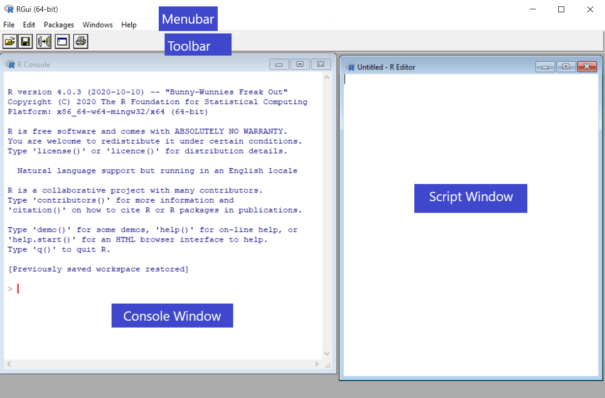
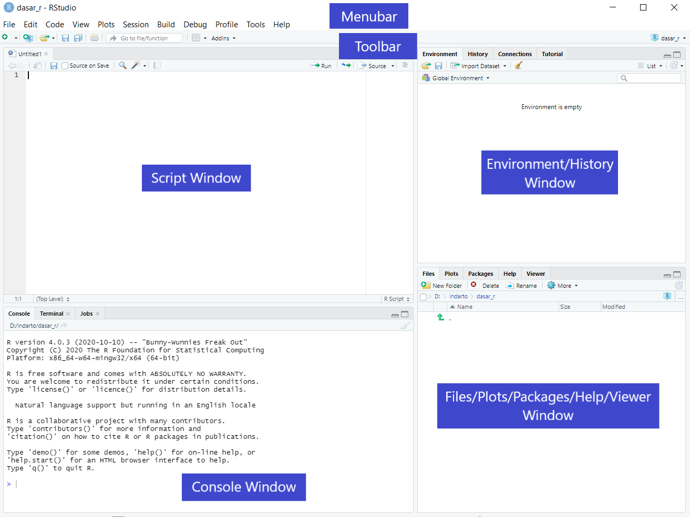

```{r setup, include=FALSE}
knitr::opts_chunk$set(tidy.opts = list(width.cutoff=60), tidy=TRUE, echo=TRUE, class.output="bg-warning")
```

\newpage
# Catatan Pengantar {-}


*Bismillaahirrahmaanirrahiim...*

Mendengar bahasa *R* baru dimulai pada tahun 2015, saat tugas belajar. Pihak kampus (laboratorium dan perpustakaan) sebenarnya menyediakan berbagai perangkat lunak berbayar untuk telaah data. Namun demikian, pembimbing laboratorium mendorong penggunaan perangkat lunak dan bahasa program *open source*, yang berkembang pesat dan banyak dimanfaatkan oleh akademisi. Dan, *R* adalah salah satu bahasa program yang direkomendasikan.

Seiring dengan perjalanan waktu, berbagai kesibukan mengurangi alokasi waktu untuk menelaah data, permodelan dan perangkat lunak telaah data, secara konsisten. Walaupun sesekali berusaha untuk meluangkan waktu untuk mengenal *R*, namun hal tersebut tidak berjalan sepenuh hati.

Minggu terakhir di penghujung tahun 2020 merupakan salah satu waktu yang layak untuk disyukuri. Selama 3 hari (21 - 23 Desember 2020), mempunyai kesempatan berharga untuk belajar dan  menikmati *R* kembali^[Terima kasih kepada Perhimpunan Ekonomi Pertanian Indonesia (PERHEPI) dan *the Institute of Statistical Mathematics (ISM)* Jepang yang memfasilitasi pelatihan ini.]. Terutama dari bahan pelatihan ini *lah*, penulisan buku/modul ini bersumber.

***"Dasar R"*** kiranya merupakan judul yang mewakili isi dan pendekatan buku/modul, karena memang baru mampu menyajikan substansi dasar dan sebatas memanfaatkan fungsi dasar yang sudah ada pada bahasa *R* (*R base functions*). Sehingga, seluruh proses latihan tidak menggunakan tambahan *modul* atau *package* tambahan. Selain itu, buku/modul ini hanya menggunakan satu *dataset* yang diterapkan dari awal sampai akhir untuk berbagai bahasan dan latihan telaah. Bahasan yang dicakup dalam buku ini, mulai dari proses instalasi, penyiapan *working directory*, peninjauan data, visualisasi data, sampai dengan latihan dasar regresi sederhana.

Proses telaah dan penulisan sangat dibantu oleh *R*, *RStudio* dan *R Markdown*. Dan, buku/modul dan data latihan disediakan secara bebas [**di sini**](https://indarto.weebly.com/7/9/1/0/7910347/dasar_r.pdf).

Semoga buku/modul ini menjembatani pembaca dalam mengenal bahasa *R*, serta memotivasi pembaca untuk lebih memperdalam dan memanfaatkan *R* lebih lanjut.

&nbsp;
&nbsp;
&nbsp;

Penghujung Desember 2020,

&nbsp;

**Jarot Indarto**\
***<j.indarto@gmail.com>***\
***<https://indarto.weebly.com>***

\newpage
# Dasar Instalasi (untuk *Windows*)

Buku/modul ini diawali dengan bahasan instalasi dasar, yaitu instalasi *R*, dan juga instalasi *RStudio* jika membutuhkan *platform* tambahan untuk mempermudah proses telaah data. Selain itu, bab ini juga memberikan pilihan *platform* lain yang tersedia luas dalam menjalankan bahasa *R*.

## Instalasi *R*

*R* harus dipasang (*install*) pada perangkat, dengan langkah sederhana berikut.

* kunjungi situs: <https://cran.r-project.org/>^[CRAN: *the Comprehensive R Archive Network*.]
  - *mirror* Indonesia disediakan oleh BPTT di tautan berikut: <https://repo.bppt.go.id/cran/>.
* pilih sesuai sistem operasi (*operating system - OS*) dari perangkat:
  - *Windows* (selanjutnya akan fokus pada *OS Windows*), 
  - *Linux*, atau 
  - *Mac*.
* pilih *base* untuk *windows*: <https://cran.r-project.org/bin/windows/base/>
  - versi pada 26/12/2020: *R-4.0.3 for Windows (32/64 bit)*,
* unduh *file* instalasi.
* ikuti langkah instalasi.
* untuk sistem operasi lain, bisa disesuaikan.

R telah terpasang dalam perangkat/mesin, sehingga *R* telah siap untuk dijalankan.

> Mengapa disebut *R*? Penamaan ini sesuai dengan huruf awal dari nama pengembangnya (*__R__*oss Ihaka dan *__R__*obert Gentlement).

\newpage
Berikut tampilan antarmuka *R*.



## Instalasi *RStudio*

Pada tahap awal, pemula memerlukan wahana *platform* bantuan dalam menjalankan bahasa *R*. Salah satu pilihan *platform* bantuan adalah *RStudio*. Dan, di bawah ini adalah langkah-langkah sederhana untuk melakukan instalasi *RStudi*.

* kunjungi situs: <https://www.rstudio.com>.
* unduh *RStudio IDE*^[*IDE (Integrated Development Environment)*: perangkat lunak atau program sebagai wadah/lingkungan yang mempermudah pelaksanaan pemrograman.]:
<https://rstudio.com/products/rstudio/download/>.
  - versi pada 26/12/2020: *RStudio Desktop 1.3.1093*,
  - versi ini mensyaratkan perlunya *R* versi *R3.0.1+* atau lebih.

*RStudio* telah terpasang dalam perangkat/mesin, serta siap membantu dan mempermudah penggunaan bahasa *R*.

> Apakah *RStudio* wajib dipasang? TIDAK, namun sebagaimana fungsinya (sebagai *IDE*), maka *RStudio* dapat mempermudah telaah data dan/atau proses pemrograman dengan *R*. Tetapi, *R* wajib terpasang dalam perangkat, agar dapat menjalankan *RStudio*.

Berikut tampilan antarmuka *RStudio*.



&nbsp;

Bahasa *R* telah dapat dijalankan, baik langsung melalui aplikasi *R* maupun dengan bantuan *RStudio*.


## Menjalankan *R* dan/atau *RStudio* {#jalankanr}

Setelah proses instalasi berhasil, saatnya membuka dan menjalankan aplikasi, baik melalui *R* langsung maupun melalui bantuan *Rstudio*. 

Mari memulai perkenalan dan percakapan dengan bahasa *R*, melalui beberapa contoh sintaks sederhana di bawah ini.

* membuat (*assignment*) peubah atau *variable*.
  - *assignment* umumnya menggunakan tanda `"<-"` atau `"="`.
  - sintaks dasar membuat peubah.
```{r eval=F}
nama_peubah <- nilai_peubah
```

  - beberapa contoh pembuatan peubah.
    - membuat peubah bernama `"salam"`, yang berisi kata `"Assalaamuálaikum"`.
```{r}
salam <- "Assalaamuálaikum"

print(salam)                 # sintaks "print()" untuk mencetak
```
  - contoh lain.
```{r}
nama <- "Fulan"
usia <- 25
print(c(nama, "berumur", usia, "tahun."))
cat(nama, "berumur", usia, "tahun.")      # cat: concatenate
```

Kita telah mulai berkenalan dengan bahasa *R*. Juga, kita telah memastikan bahwa perangkat/mesin telah dapat menjalankan bahasa *R* dengan baik.


## Pilihan Lain

Selain langsung melalui aplikasi *R* maupun bantuan *RStudio*, bahasa *R* juga dapat dijalankan melalui beberapa *notebook platform/environment*, tanpa melakukan proses instalasi dalam perangkat/mesin. Di bawah ini disajikan beberapa  *notebook*^[*Notebook* atau *notebook document* merupakan *platform* yang mampu memadukan antara pengkodean (penulisan kode, menjalankan kode, dan hasil pengkodean, termasuk visualisasi data), dengan narasi teks, penulisan karakter matematika, dan media lain dalam satu dokumen.], yang dapat dimanfaatkan untuk menjalankan bahasa *R*, baik yang berdiri-sendiri maupun yang berbasis *web/cloud*.

***a. Jupyter Notebook***

* *Jupyter notebook* dapat dipasang dan dijalankan tersendiri, dengan langkah-langkah yang tersedia di tautan berikut: <https://jupyter.org/install>.
* atau sebagai bagian dari *Anaconda toolkit*, yang dapat diunduh di sini: <https://www.anaconda.com/products/individual>.
* dapat dijalankan di luar jaringan (luring) untuk menjalankan *Jupyter*.

> Dinamakan *Jupyter*, karena pada awalnya dikembangkan untuk mendukung penggunaan bahasa program ***Ju***lia - ***Pyt***hon - ***R***.

\newpage
***b. Google Colaboratory Notebook (Google Colab)***

* merupakan *platform* gratis berbasis *Jupyter notebook* yang dijalankan sepenuh melalui *cloud*.
* *Google Colab* sebenarnya dirancang untuk menjalankan bahasa *Python*.
* namun demikian, *Google Colab* dapat menjalankan bahasa *R*, dengan mengakses melalui tautan berikut:
   - <https://colab.research.google.com/#create=true&language=r>, atau
   - <https://colab.to/r>.
* perlu masuk dalam jaringan (daring) untuk menjalankan *Google Colab*.

***c. Kaggle Notebook***

* *Kaggle* menyediakan fasilitas pengkodean *R* ini, dengan mengakses melaui tautan ini:  <https://www.kaggle.com/notebooks>.
* perlu masuk dalam jaringan (daring) untuk menjalankan *Kaggle Notebook*.

***d. Azure Notebooks***^[Dalam situs resminya, yang kami akses pada 30-Desember-2020, diberikan pengumuman sebagai berikut: "*The Azure Notebooks preview will be retired on January 15th, 2021, and all user data will be destroyed. Please download your user data before then. To execute notebooks or create new notebook content, learn about our other notebooks experiences at Microsoft*". Saat ini, *Microsoft* mengembangkan beberapa *platform* layanan, antara lain: *Visual Code*, *Github Codespace*, *Azure Machine Learning*, maupun *Azure Lab*. Pilihan layanan tersebut dapat diakses di sini: <https://notebooks.azure.com/Content/alternatives.html>.]

* *Microsoft* mengembangkan *Azure Notebooks* sebagai *platform* bahasa program berbasis *Jupyter Notebook*, yang dapat digunakan untuk menjalankan bahasa R.
* *Azure Notebooks* dapat diakses di sini: <https://notebooks.azure.com/>.
* perlu masuk dalam jaringan (daring) untuk menjalankan *Azure Notebook*.

***e. Amazon SageMaker***

* *Amazon* juga mengembangkan *cloud platform* sebagai *Amazon Web Services (AWS)*. 
* salah satu fasilitas *AWS* adalah *Amazon SageMaker*, yang berbasis *Jupyter Notebook* dan dapat digunakan untuk menjalankan bahasa *R* melalui tautan: <https://aws.amazon.com/sagemaker/>.
* perlu masuk dalam jaringan (daring) untuk menjalankan *Amazon SageMaker*.

***f. IBM DataPlatform Notebooks***

* Pilihan lain untuk menjalankan *R* adalah *IBM DataPlatfrom Notebook* yang dikembangkan oleh *IBM Watson Data Platform and Data Science Experince (DSX)*.
* fasilitas ini dapat dinikmati melalui tautan berikut: <https://dataplatform.cloud.ibm.com/>.
* perlu masuk dalam jaringan (daring) untuk menjalankan *IBM Notebook*.

&nbsp;

Dengan telah terpasangnya *R*, maka telaah data dan/atau pemrograman sudah dapat dilakukan dengan bahasa *R* dalam perangkat. *RStudio* juga dapat dijalankan untuk mempermudah proses tersebut. Selain itu, beberapa pilihan *notebooks platform*, baik yang berdiri-sendiri maupun *web-based/cloud*, terbuka luas untuk menjembatani kita dalam menjalankan bahasa *R*. 

Selain itu, kita telah berkenalan dengan beberapa sintaks (*script*) dalam bahasa *R*. Bab-bab selanjutnya membahas telaah data dan *dataset* dengan bahasa *R*.


\newpage
# Dasar Penyiapan Direktori Kerja dan *Dataset*

Bab ini menyajikan beberapa persiapan awal sebelum melakukan telaah data. Persiapan ini ditujukan untuk mempermudah langkah-langkah selanjutnya. Bahasan meliputi penyiapan direktori kerja (*working directory - wd*), penyiapan *file* data yang akan ditelaah, penyiapan *dataset* agar dapat dibaca oleh bahasa *R*, serta pengenalan beberapa tipe data atomik bahasa *R*.


## Penyiapan *Working Directory (wd)*

Sebelum menelaah data lebih lanjut, kita menyiapkan *folder* direktori kerja (*wd*) terlebih dahulu. *Folder* ini merupakan *working directory* yang dipergunakan untuk menyimpan seluruh file yang diperlukan dan akan dihasilkan dalam dalam proyek (*project*) kita.

* melihat posisi/jalur (*path*) *folder* saat ini.
```{r eval=F} 
getwd()   # membaca posisi folder dimana mesin bekerja saat ini
```

* mengatur *path* pada *folder* *wd* yang kita ingingkan.
```{r}
setwd("D:/indarto/r_boekoe")  # contoh folder yang disiapkan
```

* membaca data apa saja yang berada pada *folder wd*.
```{r, eval=F, results=F, echo=T}
dir()
```

## Penyiapan *File* Data

Untuk mempermudah dan menyederhanakan pemahaman, buku/modul ini telah menyiapkan data jadi^[Topik tentang pembuatan data, konversi tipe dan format data, penggalian data (*data mining*), dan lain-lain, belum dibahas dalam buku/modul ini; namun, sangat disarankan untuk dipelajari lebih lanjut.], untuk dipergunakan pada latihan-latihan pada Bab-bab selanjutnya.  Data latihan ini adalah ***"tree.csv"*** dan berbentuk format ***.csv***^[*Comma Separated Values*, kadang disebut *Character Separated Values* atau *Comma Delimited File*, merupakan format *file* dalam bentuk teks dimana data disimpan dan dipisahkan dengan tanda tertentu (koma, titik koma, *tab*, dan lain-lain)], dengan tanda koma (,) sebagai *delimiter*. Data latihan ini dapat diunduh melalui tautan berikut: <https://indarto.weebly.com/uploads/7/9/1/0/7910347/tree.csv>.

* sekilas tentang isi data **"tree.csv"**.
  - data merupakan pengamatan dari 95 pohon.
    - terdiri dari 5 kelompok, yaitu kelompok 7, kelompok 12, kelompok 15, kelompok 31, dan kelompok 37.
    - kelompok ini berada pada kolom pertama "treeID".
  - *variable* yang diamati meliputi:
    - "Age": umur pohon.
    - "DBH": *diameter at breast height* (diameter pada ketinggian 4.5 kaki dari permukaan tanah).
    - "Height": tinggi pohon.
    - "Volume": volume kayu.
* silahkan mengunduh *file* data latihan tersebut [di sini](https://indarto.weebly.com/uploads/7/9/1/0/7910347/tree.csv).
* simpan dalam *folder wd* yang telah kita siapkan di atas.
* periksa dan pastikan kembali bahwa *file* latihan tersebut telah siap di *folder wd*.
```{r, eval=F, results=F, echo=T}
dir()
```

Kita telah menyiapkan *folder wd* dan memastikan bahwa data telah berada pada *folder wd* tersebut.

## Penyiapan *Dataset* bagi *R*

Data latihan *"tree.csv"* telah siap dan berada pada *folder wd* yang diinginkan. Namun, data tersebut masih berada dalam format ekstensi *".csv"*, sehingga perlu di-*import* menjadi *dataframe* untuk bisa dibaca oleh bahasa *R*^[Sebagai bahasa program, *R environment* mampu membaca, menuliskan, meng-*import*, atau meng-*export* data dari/ke berbagai tipe format *file* (antara lain: *.csv*, *.xlsx*, *.txt*, *.rds*, *.xml*, *.json*, maupun dari situs, dan lain-lain). Buku/modul ini tidak memberikan pembahasan khusus tentang ini, namun sangat disarankan untuk dapat dipelajari lebih lanjut.]. Dari sesi di atas, *file* ***tree.csv*** telah disimpan dalam *wd*.

* membuat (*assignment*) *dataset*, sintaks: `nama_dataset <- isi_dataset`.
  - membuat *dataset* bernama **"pohon"** yang berisi data dari *file* **"tree.csv"**.
```{r}
pohon <- read.csv("tree.csv")
```

  - R juga bisa langsung mengakses data langsung dari sumber situsnya (perlu terhubung ke internet).
```{r, eval=F, results=F, echo=T}
pohon <- read.csv("https://indarto.weebly.com/uploads/7/9/1/0/7910347/tree.csv")
```

  - bisa menambahkan *parameter* "header=T" karena baris pertama pada data **"tree.csv"** adalah *header* (nama kolom).
```{r}
pohon <- read.csv("tree.csv", header=T)
```

* memeriksa dan memastikan bahwa *dataset* **"pohon"** telah ada pada *folder wd*.
```{r results=F}
ls()
```

* memeriksa *class* dari data *pohon*.
  - sintaks: `class()`.
```{r}
class(pohon)
```

*File* data *tree.csv* yang awalnya berbentuk *csv*, sekarang berbentuk kelas *dataframe*^[*Dataframe* merupakan salah satu bentuk *R-objects*. Beberapa jenis *R-objects*, antara lain: *vectors*, *lists*, *matrices*, *arrays*, *factors*, dan *dataframe*. Pilihan *R-objects* tersebut, memungkinkan pengguna dalam memilih kelas *dataset* yang sesuai untuk menyimpan datanya. Buku/modul ini tidak membahas jenis *R-objects* tersebut; namun, sangat disarankan untuk dipelajari lebih lanjut.] dan siap dijalankan oleh bahasa *R*.


## Pengenalan Tipe Data{#tipedata}

Dari peubah-peubah yang dibuat pada Bab sebelumnya, sesi [Menjalankan *R* dan/atau *RStudio*](#jalankanr) , kita mengenal beberapa tipe data. Bahasa R mengenal tipe-tipe data, disebut sebagai ***atomic data types***, antara lain: ***character***, ***numeric***, ***logical***, *complex* dan *raw*. Tiga *atomic data types* diperkenalkan di bawah ini. Sintaks: `class()` atau `typeof()`.

**a. Data Karakter (*character* atau *string*)**

* peubah bukan angka.
* data karakter dituliskan di dalam tanda petik ("data_karakter").
  - contoh, peubah "salam" dan "nama" di atas merupakan data karakter.
```{r}
class(salam)
class(nama)
```

* angka jika ditulis dalam tanda petik, maka merupakan data karakter.
```{r}
class(usia)
class("25")
```

**b. Data Numerik (*numeric*)**

* peubah angka.
* dapat berupa angka bulat (tanpa desimal).
```{r}
class(usia)
```

* dapat berupa angka desimal.
```{r}
ipk <- 3.45
class(ipk)
```

* data numerik memungkinkan untuk diolah dengan operasi aritmatika (penambahan, pengurangan, perkalian, pembagian, pangkat, dan lain-lain).
```{r}
next5years <- usia + 5  # usia lima tahun ke depan
print(next5years)
class(next5years)
```

**c. Data Logika (*logical* atau *boolean*)**

* bernilai *TRUE* (*T*) atau *FALSE* (*F*).
```{r}
lulus <- ipk >= 2.75
print(lulus)
class(lulus)
```

Data kategori (*categorical*) akan disajikan contohnya pada akhir sesi [Tinjauan *Dataset*](#tinjauan-dataset). Sedangkan, tipe data atomik lain (misalkan: *complex*, *integer*, *real*, atau *raw*) tidak dibahas dalam buku/modul ini; namun, disarankan untuk dapat dipelajari lebih lanjut.


\newpage
# Dasar Tinjauan Data

Kita telah menyiapkan direktori kerja dan *dataset* yang sudah dapat dibaca oleh bahasa *R*. Selanjutnya, Bab ini mengenalkan dasar-dasar untuk meninjau isi dari *dataset* kita. Bahasan meliputi tinjauan umum *dataset*, tinjauan baris dan kolom (atau dikenal sebagai proses *subsetting*, *slicing* atau *extracting*), serta modifikasi sederhana terhadap data (penambahan dan penghapusan dan kolom).

## Tinjauan *Dataset* {#tinjauan-dataset}

*Dataset* berisi sekumpulan data, dalam bentuk baris dan kolom. *Dataset* dapat terdiri dari satu atau lebih baris dan satu atau lebih kolom. Dengan demikian, *dataset* paling tidak mempunyai satu baris dan satu kolom.

Dalam *dataset* "pohon" yang digunakan dalam latihan buku/modul ini, satu kolom mewakili satu *variable*, sehingga pada kolom yang sama bertipe data yang sama.

Selanjutnya, kita melakukan tinjauan singkat terhadap *dataset* kita.

* dimensi *dataset*, sintaks: `dim()`.
```{r}
dim(pohon)  # dataset "pohon" terdiri dari 95 baris dan 5 kolom
```

* nama kolom *header* pada *dataset*, sintaks: `names()` atau `colnames()`.
```{r}
names(pohon)     # memberikan hasil yang sama
colnames(pohon) 
```
Terlihat bahwa *dataset* "pohon" mempunyai 5 kolom atau *header* atau *variable*, yaitu: "treeID": kolom 1, "Age": kolom 2, "DBH": kolom 3, "Height": kolom 4 dan "Volume": kolom 5.

\newpage
* struktur *dataset*, sintaks: `str()`.
```{r}
str(pohon)
```
Sintaks `str()` menampilkan ringkasan struktur data, antara lain: nama kolom/*variable*, jumlah observasi, jumlah *variables* atau kolom, tipe data (*integer*, *numeric*, dll.) dan ringkasan nilai dari setiap *variable* atau kolom.

* ringkasan statistik *dataset*, sintaks: `summary()`.
```{r}
summary(pohon)
```
Sintaks `summary()` menampilkan ringkasan statistik dari setiap *variable* yang mengandung tipe data *numeric* atau *non-character*. Ringkasan meliputi: nama kolom/*variable*, *minimum*, *maximum*, *median*, *mean*, *1st quantile*, dan *3rd quantile*.

\newpage
* melihat isi atau nilai data, sintaks: `head()` atau `tail()`.
```{r}
head(pohon)  # menampilkan isi 5 baris pertama
tail(pohon)  # menampilkan 5 baris terakhir
```

Kita juga dapat mengatur jumlah baris yang akan ditampilkan, dengan menambahkan angka sebagai *parameter* pada sintaks `head()` atau `tail()` di atas.
```{r}
head(pohon, 7)  # menampilkan 7 baris pertama
tail(pohon, 3)  # menampilkan 3 baris terakhir
```

\newpage
**Data Kategori (*categorical variable*)**

Pada sesi [Mengenal Tipe Data](#tipedata), kita telah mengenal tiga tipe data atomik, yaitu *character*, *numeric*, dan *logical*. Dari *dataset* "pohon" di atas, kita menambah pengenalan tentang tipe data kategori. Dengan mencermati hasil sintaks `head(pohon)` dan `tail(pohon)` di atas, terlihat bahwa *variable* "treeID" terkategorikan dalam beberapa kelompok. 

* sintaks untuk memerika nilai unik dari variable tertentu: `unique()`.
* memeriksa struktur *variable* "treeID".
```{r}
str(pohon$treeID)  # "treeID" berjumlah 95 observasi.
```

* memeriksa nilai unik atau kelompok kategori "treeID".
```{r}
unique(pohon$treeID)
```

Walaupun "treeID" mempunyai 95 obervasi, *variable* ini mempunyai 5 kategori/kelompok, yaitu: 7, 12, 15, 31, 37.

## Tinjauan Baris dan Kolom

Kita telah melakukan tinjauan singkat terhadap *dataset* "pohon" (struktur, ringkasan statistik, dan isi). Kita akan melakukan tinjauan lebih lanjut terhadap baris atau kolom tertentu, termasuk ekstraksi (*extracting/slicing*) terhadap *dataset* kita.

* sintaks dasar untuk melakukan *slicing* baris/kolom tertentu dari *dataset*: `nama_*dataset*[baris ke-, kolom ke-]`.
* ingat kembali bahwa *dataset* "pohon" terdiri dari 95 baris dan 5 kolom.
```{r}
dim(pohon)
```

**a. Ekstrak/iris baris**

* sintaks: `dataset[baris ke-, ]`.
* mengekstrak baris ke-3, untuk seluruh kolom.
```{r}
pohon[3, ]
```

  - mengesktrak baris ke 1-5 untuk seluruh kolom.
```{r}
pohon[1:5,]  # hasilnya sama dengan sintaks "head()"
```

**b. Ekstrak/iris kolom**

* sintaks: `dataset[ , kolom ke-]`.
* ingat kembali bahwa  *dataset* "pohon" mempunyai 5 kolom atau *variables*, yaitu: kolom ke-1 = "treeID", kolom ke-2 = "Age", kolom ke-3 = "DBH", kolom ke-4 = "Height", dan kolom ke-5 = "Volume".
```{r}
colnames(pohon)
```

* mengekstrak kolom ke-3, untuk seluruh baris.
```{r}
options(width=70)  # sintaks ini tidak harus ada
pohon[ , 3]
```

* dapat juga mengekstrak kolom berdasarkan nama kolomnya; misal, mengekstrak kolom "Age", untuk seluruh baris.
```{r}
options(width=70)  # tidak wajib ada
pohon$Age  # hasilnya sama dengan sintaks "pohon[,3]" di atas
```

* mengekstrak kolom ke-2 sampai dengan kolom ke-5, untuk seluruh baris.
```{r eval=F}
pohon[ , 2:5]   # hasil tidak ditampilkan karena terlalu panjang
```

**Menambah kolom baru**

* sintaks: `dataset$namakolombaru <- isi_kolombaru`.
* misalkan, kita menambahkan kolom baru (diberi nama "rasio_tinggi"), yang diisi sebagai hasil pembagian dari "Volume" dengan "Height". 
```{r}
pohon$rasio_tinggi <- pohon$Volume/pohon$Height
```

* memastikan bahwa tambahan kolom baru tersebut sudah berhasil.
```{r}
colnames(pohon)  # periksa nama kolom
head(pohon)      # periksa 5 baris pertama
```

**Menghapus kolom**

* misalkan, kita ingin menghapus kolom "rasio_tinggi", yang baru saja kita buat.
```{r}
pohon$rasio_tinggi <- NULL
```

* untuk memastikan penghapusan tersebut, kita periksa kembali *dataset* kita.
```{r}
colnames(pohon)
head(pohon,3)
```

**c. Ekstrak/iris baris dan kolom**

* sintaks: `dataset[baris ke- , kolom ke-]`.
* mengekstrak baris ke-3 dan kolom ke-4.
```{r}
pohon[3,4]
```

* mengekstrak baris ke 1-3 dan kolom 2-5.
```{r}
pohon[1:5,2:5]
```

**d. Membuat *dataset* baru**

Dari hasil ekstraksi di atas, kita dapat membuat dan menyimpannya dalam *dataset* baru.

* sintaks, sama dengan sintaks *assignment*: `dataset_baru <- isi_dataset_baru`. 
* dari proses ekstraksi (*slicing*) data, kita dapat meng-*assign* atau membuat *dataset* baru, yang isinya hasil ekstraksi/iris di atas.
* misalkan, kita membuat *dataset* baru bernama "pohon_umur", yang berisi hanya kolom "treeID" dan kolom "Age".
```{r}
pohon_umur <- pohon[,1:2]
head(pohon_umur)          # periksa 5 baris pertama
```


Kita telah melakukan tinjauan terhadap *dataset* dan memahami isi *dataset* tersebut. Bab berikut membahas dasar visualisasi data, untuk lebih mendalami isi data kita.


\newpage
# Dasar Visualisasi Data

Visualisasi data merupakan bagian penting dalam telaah data.  Bab ini memberikan langkah-langkah dasar dalam menampilkan visualisasi data, terutama *histogram*, *boxplot*, *scatterplot*, termasuk *line*.

## *Histogram*

Histogram menampilkan distribusi probabilitas (*frequency*) dan densitas (*density*) dari data (*continous variabel*).

* Sintaks *histogram*: `hist(variable)`.

**a. *Histogram* Frekuensi**

* *histogram* dari kolom atau *variable* "DBH".
```{r, fig.height=3.5}
hist(pohon$DBH)
```

\newpage
* memberikan label nilai pada *histogram* di atas, tambahan *parameter* `labels=T`.
```{r, fig.height=3.5}
hist(pohon$DBH, labels=T)
```

* mengatur batas sumbu y (*y-axis*), tambahan *parameter* `ylim=c(batas bawah, batas atas)`. 
```{r, fig.height=3.8}
hist(pohon$DBH, labels=T, ylim=c(0,25))
```

\newpage
* mengatur jumlah kelompok sumbu X, tambahan parameter `breaks=jumlah_breaks`.
```{r, fig.height=3.8}
hist(pohon$DBH, labels=T, ylim=c(0,25), breaks=15)
```

* menambahkan judul *histogram*, tambahan *parameter* `main="judul_histogram"`.
```{r, fig.height=3.8}
hist(pohon$DBH, labels=T, ylim=c(0,25), main="Histogram Pohon")
```

\newpage
* mengubah nama sumbu X (`xlab="nama_sumbu_x"`) dan sumbu Y (`ylab="nama_sumbu_y"`).
```{r, fig.height=3.8}
hist(pohon$DBH, labels=T, ylim=c(0,25), main="Histogram Pohon", 
     xlab = "Nilai DBH", ylab="Frekuensi DBH")
```

* mewarnai *bar histogram* (`col="warna"`) dan batas *bar histogram* (`border="warna"`).
```{r, fig.height=3.8}
hist(pohon$DBH, labels=T, ylim=c(0,25), main="Histogram Pohon Berwarna", 
     xlab = "Nilai DBH", ylab="Frekuensi DBH", col="brown", border="green")
```

* pilihan lain: memberikan warna-warni yang berbeda pada setiap *bar histogram* (perhatikan tambahan *parameter* `col=c(1:8)`.
```{r, fig.height=3.8}
hist(pohon$DBH, labels=T, ylim=c(0,25), main="Histogram Warna-Warni", xlab = "Nilai DBH", ylab="Frekuensi DBH",  col=c(1:8))
```

**b. *Histogram Probability Density***

* menambahkan *parameter* `prob=T` pada *histogram* frekuensi.
  - *histogram probability density* dari *variable* "DBH".
```{r, fig.height=3.5}
hist(pohon$DBH, prob=T, col="blue", main="Histogram Prob Density")
```

* atau, tambahan *parameter* `freq=F`.
```{r eval=F}
hist(pohon$DBH, freq=F)
```

* menambahkan garis *probability density*-nya, dengan sintaks `lines(density())`.
```{r, fig.height=4}
hist(pohon$DBH, prob=T, col="blue", main="Histogram dan Lines")
lines(density(pohon$DBH), col="red")
```

**c. *Normality Checking***

Salah satu penerapan *histogram* dan *lines* adalah untuk memeriksa kenormalan data. Misal, kita ingin memeriksa kenormalan sebaran data *variable* "DBH".

* membuat *histogram probability density* "DBH".
* menambahkan *lines probability density* "DBH" (diberi warna "red").
* membuat dataset (diberi nama "x") berisi nilai angka dari nilai minimal "DBH" sampai dengan nilai maksimal "DBH".
* membuat *dataset* (diberi nama "normal") berisi distribusi normal dari "DBH".
* menambahkan *lines* antara *variable* "x" dan "normal".
```{r, fig.height=3.7}
hist(pohon$DBH, prob=T, col="blue", main="Kenormalan DBH")
lines(density(pohon$DBH), col="red")
x <- seq(min(pohon$DBH), max(pohon$DBH))
normal <- dnorm(x, mean=mean(pohon$DBH), sd=sd(pohon$DBH))   # membuat 
     # *dataset* baru berupa data distribusi normal dari "DBH"
lines(x, normal)  # me
```


## *Boxplot*

Boxplot menampilkan sebaran dari data (median, kuartil, *whiskers*, dan *outlier*). Sintaks *boxplot*: `boxplot(variables)`.

**a. *Boxplot* Vertikal**

* membuat *boxplot* *variable* "DBH".
```{r, fig.height=3.7}
boxplot(pohon$DBH)
```

* membuat *boxplot* dari *variable*/kolom ke-2 sampai dengan kolom ke-4, dengan tambahan judul dan warna. 
```{r, fig.height=3.7}
boxplot(pohon[,2:4], main="Boxplot Berwarna", col=c("red", "blue", "green"))
```

**b. *Boxplot* Horisontal**

* menambah parameter `horizontal=T`.
```{r, fig.height=3.7}
boxplot(pohon[,2:4], main="Boxplot Horisontal", col=c("red", "blue", "green"), 
        horizontal = T)
```

\newpage
## *Scatterplot*

*Scatterplot* menampilkan koleksi titik sebagai hubungan antara dua *variable*. Sintaks *scatterplot*: `plot()`.

* membuat *scatterplot* antara "Height" dan "DBH".
```{r, fig.height=3.2}
plot(Height~DBH, pohon, main="Scatterplot")
```

* menambahkan *lines*, dengan sintaks `abline(a=, b=)`.
  - *lines* dengan *intercept* a=0 dan *slope* b=1.
  - dan, *lines* dengan *intercept* a=0 dan *slope* b= 0.8.
```{r, fig.height=3.2}
plot(Height~DBH, pohon, main="Scatterplot & Lines")
abline(a=0, b=1)
abline(a=0, b=0.8, col="red", lwd=2)
```

\newpage
## *Pairwiseplot*

*Pairwiseplot* semacam matriks dari beberapa grafik *scatterplot*. 

Sintaks *pairwiseplot*: `pairs(dataset)`.

* menampilkan *pairwiseplot* dari *dataset* "pohon" untuk kolom ke-2 sampai dengan kolom ke-4.
```{r}
pairs(pohon[,2:4], main="Pairwiseplot Age-DBH-Height")
```

## Gabungan Beberapa Visualisasi Data dalam Satu Kerangka Gambar

Beberapa jenis grafik yang berbeda-beda dapat ditampilkan dalam satu kerangka (*frame*) gambar. Misal, kita ingin menampilkan 3 grafik (*histogram*, *boxplot*, dan *scatterplot*) dalam satu kerangka gambar (1 baris dengan 3 kolom).

Sintaks menyiapkan kerangka gambar:  `par(mfrow=c(jumlah_baris, jumlah_kolom))`.

\newpage
* baris 1 kolom 1 diisi *histogram* "DBH" (warna biru).
* baris 1 kolom 2 diisi *boxplot* "DBH" (warna merah).
* baris 1 kolom 3 diisi *scatterplot* "DBH" dan "Height" (warna hijau).
```{r}
par(mfrow=c(1,3))
hist(pohon$DBH, col="blue", main="Histrogram DBH")
boxplot(pohon$DBH, col="red", main="Boxplot DBH")
plot(Height~DBH, pohon, main="Scatterplot DBH-Height", col=c(treeID))
```

Kita telah mengenal pemahaman dasar dalam menampilkan beberapa pilihan visualisasi data, terutama *histogram*, *boxplot*, *scatterplot* dan *lines*.

\newpage

# Dasar Regresi Sederhana

Visualisasi grafik dari data sangat berguna dalam menampilkan isi dan perilaku data kita. Visualisasi juga mempermudah mengkomunikasikan data dengan pihak yang kita inginkan. Guna mendukung telaah data dengan bukti kuantitatif, Bab ini memberikan pemahaman dasar dalam melakukan regresi data. Bahasan meliputi hal-hal dasar tentang statistik, regresi linear dan regresi non-linear.

## Dasar Statistik Deskriptif
Sesi ini sekedar untuk mengingatkan kembali tentang cara memperoleh beberapa nilai statistik deskriptif dari data.

* menghitung nilai minimal `min()` dan maksimal `max()`.
```{r}
min(pohon$Height)            # nilai minimum dari "Height"
max(pohon$Height)            # nilai maksimum dari "Height"
```
  - pada sesi sebelumnya, sintaks `summary()` telah dikenal, untuk menampilkan ringkasan statistik.
```{r}
summary(pohon$Height)
```
* menghitung penjumlahan (*summation*) data.
```{r}
sum(pohon$Height)            # penjumlahan dari "Height"
```

\newpage
* menghitung panjang atau jumlah observasi data.
```{r}
length(pohon$Height)         # jumlah observasi dari "Height"
```
* menghitung *variance*, *standard deviation*, *covariance*, dan *correlation*.
```{r}
var(pohon$Height)            # variance
sd(pohon$Height)             # standard deviation
cov(pohon$Height, pohon$DBH) # covariance
cor(pohon$Height, pohon$DBH) # correlation
```

Sesi selanjutnya menyajikan pembahasan model regresi sederhana, baik regresi *linear* maupun regresi *non-linear*. 

\newpage
## *Linear Model (lm)*

Model linear dapat terdiri dari *independent variable* tunggal (*simple linear model*) atau *independent variable* yang lebih dari satu (*multiple linear model*). 

### *Simple Linear Model*
Model teoretis (*theoretical model*) dari model *linear* tunggal seperti di bawah ini.
$$ Y = \alpha + \beta X $$
Pada sesi visualisasi, kita telah mengenal sintaks `abline(a=, b=)`, dimana nilai "a" adalah *intercept*, dan nilai "b" adalah *slope*. Dalam fungsi *linear* tunggal di atas, $\alpha$ = "a" = *intercept*; dan $\beta$ = "b" = *slope*.

Latihan kasus di bawah ini ingin membangun model *linear* tunggal, untuk melihat pengaruh *variable* "DBH" terhadap *variable* "Height". Dengan demikian, model empiris (*empirical model*) *linear* tunggalnya dituliskan sebagai berikut.
$$ Height = \alpha + \beta DBH $$
Data yang digunakan bersumber dari *dataset* "pohon". Namun demikian, kita hanya membatasi pada kelompok pohon ke-7 ("treeID=7").

* mengekstrak dan membentuk *dataset* baru ("pohon7"), yang berisi seluruh *variable* dari pohon kelompok ke-7.
  - sintaks untuk *slicing*: `dataset[baris ke-, kolom ke-]`.
```{r}
pohon7 <- pohon[pohon$treeID==7,]
```

  - meninjau ringkasan *dataset* "pohon7".
```{r}
head(pohon7)
```

\newpage
```{r}
tail(pohon7)
```

* menampilkan visualisasi hubungan "DBH" dan "Height".
```{r}
plot(pohon7$DBH, pohon7$Height, main="Hubungan DBH - Height")
abline(a=0, b=1)
abline(a=0, b=0.5)
abline(a=1, b=1)
abline(a=0, b=0.8, col="red")
```

* sintaks model *linear* tunggal sebagai berikut.\
`lm(Y~X, data="nama_dataset")`

\newpage
* menjalankan model *lm* antara *variable* "Height" dan variable "DBH".
  - hasilnya, kita *assign* sebagai *variable* bernama "lm_pohon7".
```{r}
lm_pohon7 <- lm(Height~DBH, data=pohon7)
lm_pohon7
```

* model di atas menghasilkan nilai di bawah ini.
  - $\alpha$ = *intercept* = a = 0.0717.
  - $\beta$ = *slope* = b = 0.8177.
  - sehingga hasil model empirisnya adalah sebagai berikut.
$$ Height = 0.0717 + 0.8177 DBH $$
* menampilkan visualiasi hasil model. 
```{r}
plot(pohon7$DBH, pohon7$Height, main="Hasil lm Height~DBH")
abline(lm_pohon7, col="blue")
text(5,10, "Height = 0.0717 + 0.8177DBH", cex=0.8)
```

* menampilkan ringkasan dari hasil model.
```{r}
summary(lm_pohon7)
```

* menampilkan visualisasi model.
```{r, out.width='95%'}
par(mfrow=c(2,2))  # menyiapkan kerangka grafik: 2 baris dan 2 kolom
plot(lm_pohon7)
```


### *Multiple Linear Model*

*Multiple linear model* mempunyai *independent variable* lebih dari satu. Model teoretis (*theoretical model*) dari *multiple linear model* adalah sebagai berikut.
$$Y = \alpha + \beta_1X_1 + \beta_2X_2 $$
Latihan di bawah ini menggunakan *dataset* "pohon", untuk menelaah *variables* yang mempengaruhi "Volume".

* dari sintaks `cor()`, kita bisa menampilkan keterhubungan (*correlation*) antar *variable*.
```{r}
cor(pohon)
```

Agar lebih sederhana, kita membatasi pada dua *independent variable* ("DBH" dan "Height") terhadap "Volume", dengan model empiris sebagai berikut.
$$Volume = \alpha + \beta_1DBH + \beta_2Height $$

* sintaks *multiple linear model* sebagai berikut.\
`lm(Y~X1+X2, data="nama_dataset")`

* menjalankan dan menyimpan model empiris *lm* tidak tunggal, dengan nama "lmm_pohon".
```{r}
lmm_pohon <- lm(Volume~DBH+Height, data=pohon)
lmm_pohon
summary(lmm_pohon)
```

Dari hasil di atas, maka hasil model empirisnya adalah sebagai berikut.
$$Volume = -0.023080 - 0.006463 DBH + 0.016939 Height $$

* menampilkan visualisasi dari hasil model empiris.
```{r, out.width='90%'}
par(mfrow=c(2,2))
plot(lmm_pohon)
```

\newpage

## *Nonlinear Model - Nonlinear Least Square (nls)*

Pada beberapa kasus, hubungan antara *independent variable X* dan *dependent variable Y* tidak selalu bersifat *linear*. Sesi ini menyajikan dasar pemahaman terhadap *non-linear model*.

Latihan menggunakan kembali *dataset* "pohon7". Dan, telaah difokuskan pada keterhubungan antara "Age" (sebagai *independent variable*) dan "DBH" (sebagai *dependent variable*).

* menginspeksi *dataset* "pohon7".
```{r}
head(pohon7)
```

Terlihat bahwa baris ke-1 dan ke-2 mempunyai nilai "Volume" = 0, sehingga kita tidak ingin menggunakan data baris ke-1 dan ke-2.

* mengekstrak dan membuat *dataset* baru (dinamakan "pohon71"), yang berisi seluruh dari dari *dataset* "pohon7" yang mempunyai "Volume">0.
```{r}
pohon71 <- pohon7[pohon7$Volume>0,]  # mengekstrak dataset "pohon7"
               # yang "Volume">0
head(pohon71)
```

* menampilkan visualisasi hubungan "Age" dan "DBH".
```{r, fig.height=4}
plot(pohon71$Age, pohon71$DBH, main="Visualisasi Linear Age-DBH")
lm_pohon71 <- lm(DBH~Age, data=pohon71)
abline(lm_pohon71)
text(12,8, "DBH = 2.4721 + 0.7403Age", cex=0.8)
```

Terlihat bahwa sebaran observasi bersifat *sigmoid*, dan terlihat bahwa *linear model* kurang sesuai untuk memodelkan hubungan antara *Age* dan *DBH*.

* salah satu model *non-linear sigmoid curve* atau *growth analysis* adalah *Bertalanffy function*, dengan model teoretis sebagai berikut.
$$ Y = \alpha(1-e^{-\beta X})^3 $$

Dengan demikian, model empiris yang dibangun adalah sebagai berikut.
$$ DBH = \alpha(1-e^{-\beta Age})^3 $$

* menampilkan visualisasi *scatterplot* dari kedua *variables*.
* dan, melakukan *trial and error* untuk mencari nilai $\alpha$ ("a") dan nilai $\beta$ ("b") yang paling mendekati.
```{r, fig.height=4}
plot(pohon71$Age, pohon71$DBH, ylim=c(0,20), 
     main="Trial & Error Kurva Sigmoid")

y1 <- 10*(1-exp(-0.1*pohon71$Age))^3
lines(pohon71$Age, y1, col="red")

y2 <- 10*(1-exp(-0.2*pohon71$Age))^3
lines(pohon71$Age, y2, col="blue")

y3 <- 20*(1-exp(-0.1*pohon71$Age))^3
lines(pohon71$Age, y3, col="green")

y4 <- 20*(1-exp(-0.2*pohon71$Age))^3
lines(pohon71$Age, y4, col="purple")
```

Terlihat bahwa *lines* yang paling mendekati observasi adalah *lines* dengan nilai a=20 dan b=0.2 (garis warna ungu).

* menjalankan model empiris dengan menggunakan nilai a dan b di atas.
```{r}
nls_bert_pohon71 <- nls(pohon71$DBH~a*(1-exp(-b*pohon71$Age))^3, data=pohon71, 
                        start=list(a=20, b=0.2))
nls_bert_pohon71
```

\newpage
```{r}
summary(nls_bert_pohon71)
```

Dari hasil tersebut, maka hasil model empirisnya adalah sebagai berikut.
$$ DBH = 15.7731(1-e^{-0.2244 Age})^3 $$

* menampilkan visualisasi data observasi dan data hasil model empiris.
```{r, out.width='95%'}
plot(pohon71$Age, fitted(nls_bert_pohon71), type="o", 
     main="Hasil nls Bertalanffy")
```

Bab ini menyajikan secara sederhana contoh penerapan bahasa *R* untuk statistik deskriptif maupun inferensia, baik *linear regression* (*lm*) maupun *nonlinear regression* (*nls*).

\newpage
# Catatan Penutup {-}

Sebagaimana judulnya, ***Dasar R***, buku/modul ini menyajikan hal-hal dasar tentang bahasa *R*. Juga, materi yang disajikan relatif sederhana, dengan hanya memanfaatkan kapasitas *built-in* yang sudah ada di bahasa *R*, tanpa menambahkan suatu *modul* atau *package* tambahan. Selain itu, latihan-latihan juga hanya menggunakan satu *dataset* dari awal sampai akhir. Harapannya, buku/modul ini bisa memberikan pengenalan awal sehingga siapapun bisa menikmati percakapan dengan bahasa *R*.

Ke depan, sangat dimungkinkan untuk dilakukan pemutakhiran (*updating*) materi, baik berupa penambahan, koreksi, modifikasi atau bahkan pengurangan, untuk lebih menyesuaikan kebutuhan pengguna. Oleh karena itu, kritikan dan masukan sangat dinantikan melalui email: **<j.indarto@gmail.com>**. Buku/modul dan data latihan juga disediakan secara bebas di situs **<https://indarto.weebly.com>** ini.

*Alhamdulillaahirrabbiláalamiin...*


# References {-}


